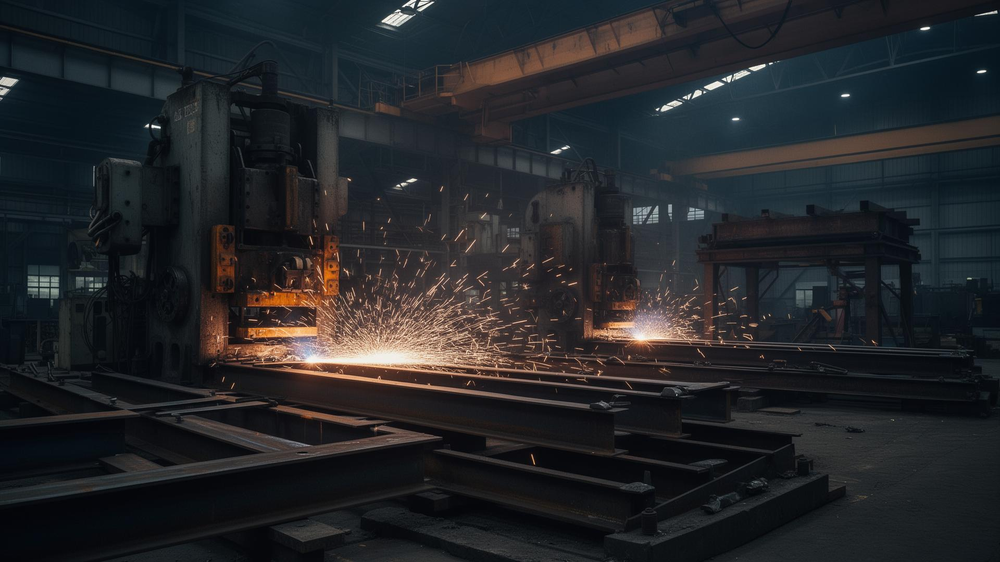

# 🏗️ KFab Infra Project PVT LTD — Heavy Steel Fabrication Platform



[](https://kfabinfraproject.site)
[](https://react.dev/)
[](https://tailwindcss.com/)
[](https://firebase.google.com/)
[](https://vercel.com/)

---

## 📌 Executive Summary

**KFab Infra Project PVT LTD** is a leading heavy steel fabrication and industrial manufacturing enterprise located at **C-46, M.I.D.C., Jejuri, Pune, Maharashtra (412303)**. Established in **1998**, the company has delivered over **500+ heavy industrial projects** across India spanning sugar mills, cement plants, railway & metro infrastructure, chemical facilities, paper mills, and material handling systems.

This repository contains the complete source code for KFab Infra's enterprise web application. The platform serves as a data-dense, interactive digital showcase featuring real-time project metrics, heavy equipment visualizer, quote inquiry pipeline, NDT quality assurance standards, B2B compliance policies, and automated technical SEO engine.

---

## 🏭 Real Project Work & Infrastructure Gallery

Here are key heavy fabrication projects engineered and manufactured at our 15,000 sq. ft. MIDC Jejuri facility:

### 1. Metro & Railway Heavy Girders
High-capacity structural steel girders and open-web bridge spans fabricated for major metro rail and Indian Railways infrastructure projects under strict quality control.


* *Service Page*: [Metro & Railway Girders Showcase](https://kfabinfraproject.site/services)
* *Key Specs*: High tensile steel fabrication, ultrasonic NDT tested welds, anti-corrosive industrial coating.

---

### 2. Sugarcane Vessels & Process Equipment
Heavy-duty sugarcane processing vessels, calandrias, juice heaters, and evaporators built for sugar factories across Maharashtra and Karnataka.


* *Service Page*: [Sugar Plant Equipment](https://kfabinfraproject.site/services)
* *Key Specs*: Stainless steel & mild steel hybrid cladding, high-pressure tolerance, ASME standard welding.

---

### 3. Industrial Silos & Conical Storage Tanks
Custom frustum & conical silos designed for bulk storage of cement, ash, grain, and chemical powders with heavy supporting steel stools.


* *Service Page*: [Silo & Storage Tanks](https://kfabinfraproject.site/services)
* *Key Specs*: Heavy plate rolling, precision dish-end caps, leak-proof seam welding.

---

### 4. Underground Diesel & Fuel Storage Tanks
Underground and above-ground double-walled diesel storage tanks engineered for industrial fuel storage compliance and safety.


* *Service Page*: [Underground Diesel Tanks](https://kfabinfraproject.site/services)
* *Key Specs*: Hydro-tested at high pressure, bitumen anti-corrosion coating, custom nozzle fittings.

---

### 5. EOT Cranes & Goliath Crane Legs
Heavy-duty material handling structures, EOT crane girders, and Goliath crane support legs manufactured for heavy manufacturing plants.


* *Infrastructure Page*: [Factory Machinery & Equipment](https://kfabinfraproject.site/infrastructure)
* *Key Specs*: High load-bearing capacity, precision pin-joint alignment, CNC beam assembly.

---

## 🛠️ Technology Stack & Architecture

| Layer | Technology | Purpose |
|---|---|---|
| **Core Framework** | React 18 + TypeScript | Type-safe, component-driven UI development |
| **Build Tooling** | Vite | Lightning-fast HMR and optimized production bundling |
| **Styling & Design System** | Tailwind CSS + CSS Modules | Custom industrial dark theme with HSL gold accents (`#D4AF37`) |
| **Animations** | Framer Motion | Smooth scroll reveals, micro-interactions, and page transitions |
| **Data Visualization** | Recharts | Interactive charts for workforce distribution and tonnage output |
| **UI Components** | Shadcn UI + Lucide Icons | Accessible dialogs, toast notifications, tooltips, and icons |
| **Database** | Firebase Firestore | Real-time storage for client quote inquiries and contact leads |
| **Email Service** | EmailJS | Instant automated email alerts sent to KFab engineering team |
| **SEO Architecture** | React Helmet Async + Custom JSON-LD | Dynamic title, meta description, OpenGraph, Schema.org payload |
| **Deployment** | Vercel Edge Network | Global CDN hosting, SSL termination, automatic preview builds |

---

## 🚀 How It Was Built — Step-by-Step Development Journey

### Phase 1: Engineering Requirements & Brand Identity
- Conducted deep-dive analysis of KFab's 25-year fabrication portfolio.
- Designed a custom **Industrial Dark Palette** featuring slate charcoal (`#0F172A`), industrial bronze/gold (`#D4AF37`), and safety amber accents.
- Established typography pairing serif headlines (playfair/cormorant aesthetic for legacy pride) with modern sans-serif body text for technical clarity.

### Phase 2: Core Components & Interactive Layout
- Built modular component system:
  - `Navbar.tsx`: Sticky responsive header with instant mobile drawer and quick contact triggers.
  - `Footer.tsx`: Rich footer featuring company overview, quick routing, contact info, and legal links.
  - `ScrollReveal.tsx` & `StaggerContainer.tsx`: Motion-driven viewport animations.
  - `FloatingWhatsApp.tsx`: Direct 1-click WhatsApp business chat widget.

### Phase 3: Specialized Industrial Pages
- **Home (`Index.tsx`)**: High-impact hero section with industrial video/image backdrops, dynamic stats counters, services grid, client marquee, and interactive map.
- **About Us (`AboutPage.tsx`)**: 25+ years company timeline, leadership bios (Founder Pramod Singh, Marketing Lead Ajeet Singh, CFO Abhishek Singh, CTO Ritesh Singh, Site Engineers), and Recharts operational metrics.
- **Services (`ServicesPage.tsx` & `ServiceDetail.tsx`)**: Comprehensive catalog of 10+ fabrication verticals with individual slug-based routing.
- **Infrastructure (`InfrastructurePage.tsx`)**: Facility equipment breakdown (CNC plasma cutters, plate rolling machines, submerged arc welding powerhouses).
- **Quality Assurance (`QualityPage.tsx`)**: ISO standards, NDT testing protocols (Ultrasonic, Radiographic, Magnetic Particle), and tolerance benchmarks.
- **Clients (`ClientsPage.tsx`)**: Major industrial partner showcase including BHEL, WMI Cranes, SISCOL, Towell Engineering.
- **Careers (`CareersPage.tsx`)**: Job listing portal for welders, fitters, NDT technicians, and site supervisors.
- **Contact (`ContactPage.tsx`)**: Interactive multi-field quote request form connected to Firebase & EmailJS.

### Phase 4: Legal & B2B Compliance Setup
- Created long-form, human-written **Privacy Policy (`/privacy`)** and **Terms of Service (`/terms`)** tailored specifically to heavy engineering contracts, data security, and Indian legal jurisdiction (Pune, Maharashtra).

### Phase 5: Technical SEO Transformation
- Built centralized `seo.config.ts` defining canonical URLs, OpenGraph metadata, and structured JSON-LD schemas:
  - `Organization` & `LocalBusiness` schemas with precise geocoordinates (`18.2721, 74.0156`).
  - `Service` & `BreadcrumbList` schemas.
  - Custom sitemap generator script (`generate_sitemap.js`).

---

## 💻 Local Development Guide

### Prerequisites
- **Node.js**: `v18.0.0` or higher
- **npm** or **bun** package manager

### 1. Clone & Install
```bash
git clone https://github.com/SachinSingh008/KFabInfra.git
cd KFabInfra
npm install
```

### 2. Environment Setup
Create a `.env` file in the root directory:
```env
VITE_FIREBASE_API_KEY=your_firebase_api_key
VITE_FIREBASE_AUTH_DOMAIN=your_firebase_auth_domain
VITE_FIREBASE_PROJECT_ID=your_firebase_project_id
VITE_FIREBASE_STORAGE_BUCKET=your_firebase_storage_bucket
VITE_FIREBASE_MESSAGING_SENDER_ID=your_firebase_messaging_sender_id
VITE_FIREBASE_APP_ID=your_firebase_app_id
VITE_EMAILJS_SERVICE_ID=your_emailjs_service_id
VITE_EMAILJS_TEMPLATE_ID=your_emailjs_template_id
VITE_EMAILJS_PUBLIC_KEY=your_emailjs_public_key
```

### 3. Run Development Server
```bash
npm run dev
```
Open [http://localhost:5173](http://localhost:5173) in your browser.

### 4. Build & Generate Sitemap
```bash
# Generate sitemap.xml
node generate_sitemap.js

# Build production bundle
npm run build
```

---

## 🌐 Live Website & Contact Information

* **Live Website**: [https://kfabinfraproject.site](https://kfabinfraproject.site)
* **Company**: KFab Infra Project PVT LTD
* **Factory & Head Office**: C-46, M.I.D.C., Jejuri, Pune, Maharashtra 412303, India
* **Primary Phone**: +91 99224 27381 | +91 98813 09872
* **Email**: [kfab.infraproject@gmail.com](mailto:kfab.infraproject@gmail.com)
* **Working Hours**: Monday – Saturday: 9:00 AM – 6:00 PM IST

---

*© 1998–2026 KFab Infra Project PVT LTD. All Rights Reserved.*
